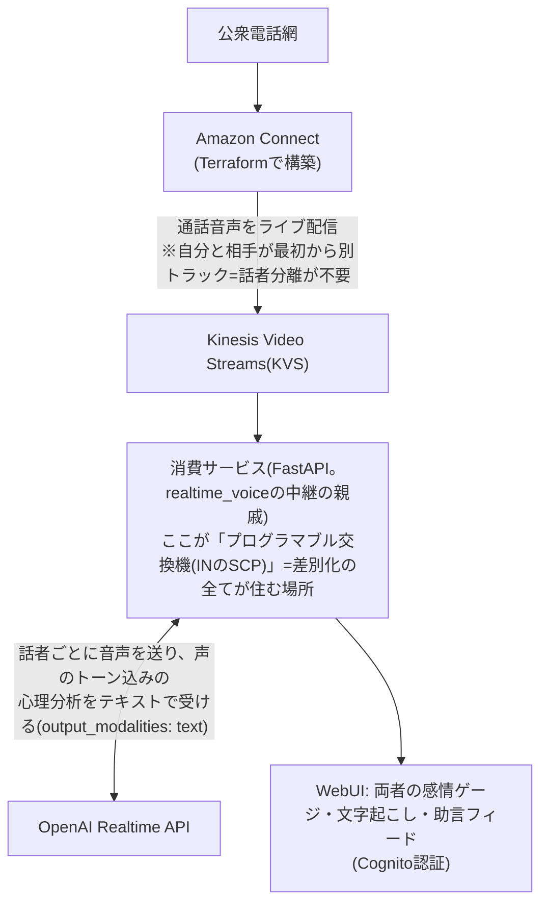

# crossbar_telepath プロジェクト憲章(Claude Code用)

**電話網の会話から、相手の心理をリアルタイムに嗅ぎ取る。**
crossbar(クロスバー交換機)+ telepath(電話線越しの読心)。
[realtime_voice](https://github.com/yoshiharu-ishii/realtime_voice) の続編として2026-07-11深夜に構想。
**現状(2026-07-12): PH1完了**。Connect基盤のTerraform(`infra/`)は架電E2E検証済みでdestroy済み(再applyで番号は変わる)。
KVSのMKVパース(旧・最難関)は `tools/extract_audio.py` で突破済み——CodecIDは"A_AAC"詐称で中身は生L16 PCM 8kHz、
トラック1=TO_CUSTOMER/2=FROM_CUSTOMER、SimpleBlock先頭4バイト剥がし。詳細はPR #1参照。

## コンセプト

TerraformでコールセンターをフルIaC構築し、通話の両話者をチャンネル分離して、
それぞれの心理状態(感情・温度感)をリアルタイムにモニタリングするWebUI。
「相手が苛立ち始めています。反論せず事実確認に徹してください」と逐次助言する。



## 決定済みの技術判断

- **Amazon Connect + Terraform**(`aws_connect_*` リソース群)。検証は自分の携帯からConnect番号へ架電し、1人で両話者を演じる
- **既知の最難関: KVSからの音声取り出し**(MKVコンテナのパース)。AWSのサンプル/ライブラリを先に調査すること
- Realtime APIは**text出力モード**で使う(音声で聞いてテキストで分析=トーンを失わない)
- **初日からコンテナ化**(uvベースのDockerfile → compose → 将来ECS Fargate)。ALBに載せる日は idle_timeout 300s以上、uvicornのws pingがそれ未満であること
- realtime_voice(公開リポジトリ)から流用: WebSocket中継パターン、WebUI、Cognito認証一式、Terraformの流儀、検証手法(合成音声・ポート分離・E2E必須)

## 市場調査の結論(2026-07-12調べ)

- コールセンターB2Bはレッドオーシャン: Cresta(200ms助言)/Balto/Google Agent Assist、国内はMiiTel(RevComm、感情可視化・リアルタイムFAQ済み)
- 個人向け「会議中の耳打ちAI」はCluelyが2025年に炎上込みで開拓済み(ステルス型・回答カンペ寄り)
- **空白**: 相手の感情読解×対応スタンス助言×日本語×誠実設計(相手への開示前提=反Cluely)
- **商用の楔があるなら**: 改正労働施策総合推進法による**カスハラ対策義務化(2026年10月)× 中小企業**(MiiTel級を買えない事業者)。需要の発生日がカレンダーに書いてある
- Amazon Connect純正のContact Lensと機能は重なる(発明ではない)。ただし「TerraformでコールセンターIaC+両話者感情モニタ自作」の日本語記事はほぼ無く、ポートフォリオ・ブログ素材として希少

## 倫理・法務の設計思想

録音同意をプロトコルに焼き込む(接続時アナウンス等)。通信の秘密(電気通信事業法)を
意識し、「相手に開示できる設計」を最初から。ステルス路線は採らない。

## MVPフェーズ案

1. Terraform: Connectインスタンス+電話番号取得+メディアストリーミング付きコールフロー
2. KVSコンシューマ → 話者別文字起こしがログに出るまで
3. 話者別の心理分析(Realtime API text出力)
4. WebUIダッシュボード(感情ゲージ×2+助言フィード)

## 運用(グローバル ~/.claude/CLAUDE.md も参照)

- PR単位で開発、検証結果をPR本文に。マージはユーザー指示で
- **図・シーケンス図はUML(Mermaid記法)で統一**。ASCIIアート図は使わない。リポジトリ内は ```mermaid で直書き(GitHubが描画)、ブログはPNGにレンダリングして貼る
- ユーザーのサーバーはポート8000、Claudeの検証は8001(終わったら止める)
- 節目でブログ化を提案(pocraft.net、~/.wp_credentials、下書き→GO待ち)
- コスト: Connectは従量+番号日額、Realtime音声入力は分単価あり。常時聴取は「無音も課金」側であることに注意
- ユーザーは元ドコモ網エンジニア。**電話網のアナロジー(交換機・SCP・シグナリング/通話路分離・呼量)で説明するのが最速**
