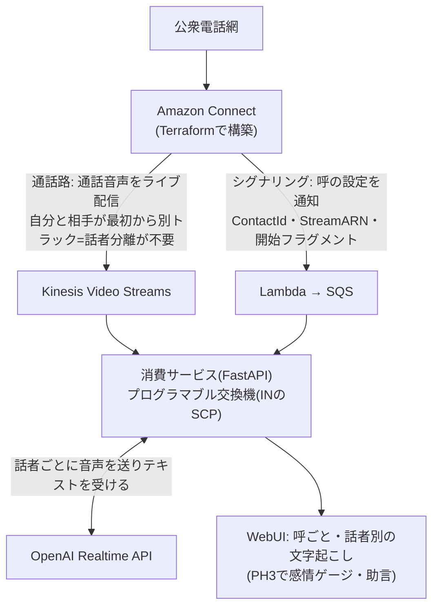

# crossbar_telepath

**電話網の会話から、相手の心理をリアルタイムに嗅ぎ取る。**

crossbar(クロスバー交換機)+ telepath(電話線越しの読心)。
TerraformでフルIaC構築したコールセンター(Amazon Connect)の通話を話者別に分離し、
それぞれの心理状態をOpenAI Realtime APIで分析、WebUIでリアルタイムにモニタリング・助言するシステム。



**通話路とシグナリングを分けている**のがこの設計の要。KVSのストリーム一覧を眺めて
呼の存在を推測するのではなく、コールフローから呼ばれたLambdaが
「いま呼が張られた。ContactIdはこれ、音声はこのストリームのこのフラグメントから」を
SQS経由で知らせる。呼とストリームの対応が確定するので取り違えが起きず、
複数の呼が同時に来ても独立して扱える。

設計の背景と技術判断は [CLAUDE.md](CLAUDE.md) を参照。

## 現状

- **PH1 完了**: Connect基盤のTerraform(`infra/`)。架電E2E検証済み
- **PH2 進行中**: KVSのリアルタイム受信 → 話者別文字起こし → WebUIへ配信

## 使い方

### 準備

```bash
cp backend/.env.example backend/.env   # OPENAI_API_KEY を設定
```

### ローカル起動

```bash
uv run --directory backend uvicorn main:app --port 8000
```

http://localhost:8000 を開く。コンテナなら `docker compose up --build`。

### 呼の履歴と録音

実通話は呼ごとに自動で記録される(交換機のCDR+録音アーカイブに相当)。
置き場は環境変数で決まり、**ローカルと本番で同じAPI・同じエンジン**を使う:

| 記録 | ローカル(compose) | 本番 | 未設定時 |
|---|---|---|---|
| 呼のメタ・発話 | PostgreSQL | Aurora PostgreSQL | `recordings/calls/*.json` |
| 通話音声(MKV原本) | MinIO | S3 | `recordings/calls/*.mkv` |

`DATABASE_URL` と `S3_BUCKET` を空にすればファイルだけで動くので、
コンテナを立てずに開発することもできる。既存の記録を移すには:

```bash
uv run python ../tools/migrate_history.py      # JSON → DB
uv run python ../tools/migrate_recordings.py   # ローカルMKV → オブジェクトストレージ
```

### スキーマ変更(Alembic)

DBのスキーマはAlembicが正。アプリ起動時に `alembic upgrade head` 相当が走るので、
開発ではサーバーを立ち上げ直すだけでスキーマが追いつく。列を足すときは:

```bash
# backend/ で db.py のテーブル定義を編集したあと
uv run alembic revision --autogenerate -m "説明"
uv run alembic upgrade head    # 起動時にも自動で走る
```

接続先は `alembic.ini` ではなく `.env` の `DATABASE_URL` を見る(設定の出どころを
アプリと一本化し、iniに秘密を書かないため)。

WebUIは左ペインの履歴から呼を選択して閲覧する。過去の呼は「この呼をリプレイ」で
音声から再処理できる(文字起こしモデルの変更やPH3の分析を過去の呼で試すときに使う)。

### 架電せずに試す(リプレイ)

`recordings/` に置いたKVS録音(MKV)を実時間のペースで流し込み、画面まで通しで確認できる。
UIの「録音をリプレイ」ボタン、またはAPIから:

```bash
curl -X POST 'http://localhost:8000/api/replay?file=call.mkv&speed=1.0'
# 過去の呼を再処理する場合
curl -X POST 'http://localhost:8000/api/replay?contact_id=<呼のID>'
```

### 実通話を拾う

`WATCH_CALLS=1` で起動すると、シグナリング用のSQSをロングポーリングし、
呼が張られるたびにその呼専用のKVSストリームから受信を始める。

```bash
WATCH_CALLS=1 uv run --directory backend uvicorn main:app --port 8000
```

`infra/` をapplyしてあることが前提(Lambdaとキューが要る)。

## 構成

| パス | 役割 |
|---|---|
| `infra/` | Amazon Connect一式のTerraform(インスタンス・番号・コールフロー・KVS設定) |
| `infra/signaling.tf` | 呼を通知するLambdaとSQS(通話路とは別経路) |
| `backend/mkv.py` | MKVの逐次パース。届いたバイトから話者別PCMを取り出す |
| `backend/audio.py` | 電話帯域8kHz → Realtime APIの24kHzへリサンプル |
| `backend/transcribe.py` | 話者1人ぶんのRealtime文字起こしセッション |
| `backend/signaling.py` | 呼の設定をSQSから受け取る |
| `backend/sources.py` | KVSライブ受信とリプレイ |
| `backend/history.py` | 呼の記録(CDR)の永続化。DBとファイルを切り替える |
| `backend/db.py` | CDRのPostgreSQL実装(スキーマもここ) |
| `backend/storage.py` | 録音の置き場(S3互換。MinIO/S3/ローカル) |
| `backend/hub.py` | 呼ごとのセッション管理とブラウザ配信 |
| `frontend/` | 話者別チャット表示のWebUI |
| `tools/extract_audio.py` | 録音MKVから話者別WAVを抽出(オフライン検証用) |

## WebSocketのメッセージ

ブラウザへは `/ws` から以下が流れる。**すべてのメッセージが `contact_id` を持ち**、
どの呼の出来事かが常に確定している。PH3の感情・助言もここに種別を足す形で載せる。

| type | 中身 |
|---|---|
| `call_started` | `contact_id`、`customer_number`(発信者番号)、`label`、`ts` |
| `call_ended` | `contact_id`、`ts` |
| `transcript` | `speaker`(customer/agent)、`item_id`、`delta` または `text`、`final` |
| `speech` | 発話区間の開始・終了 |
| `error` | Realtime API側のエラー |

## 既知の性質・注意点

- KVSのMKVは **CodecIDが `A_AAC` を名乗るが中身は生L16 PCM**(8kHz/16bit/mono)。
  ffmpegはAACとしてデコードしようとして失敗するため、EBMLを自前で歩いている
- トラック番号と話者の対応は決め打ちせず、MKVの `Tracks` 要素から読む
  (実測では 1=AUDIO_TO_CUSTOMER、2=AUDIO_FROM_CUSTOMER)
- 文字起こしの区切りはOpenAIのserver VADに任せている(こちらで無音検出はしない)
- 通話録音は個人データ。`recordings/` はgitignore済みで、**絶対にコミットしない**

前作: [realtime_voice](https://github.com/yoshiharu-ishii/realtime_voice) /
開発記: [pocraft.net](https://pocraft.net)
