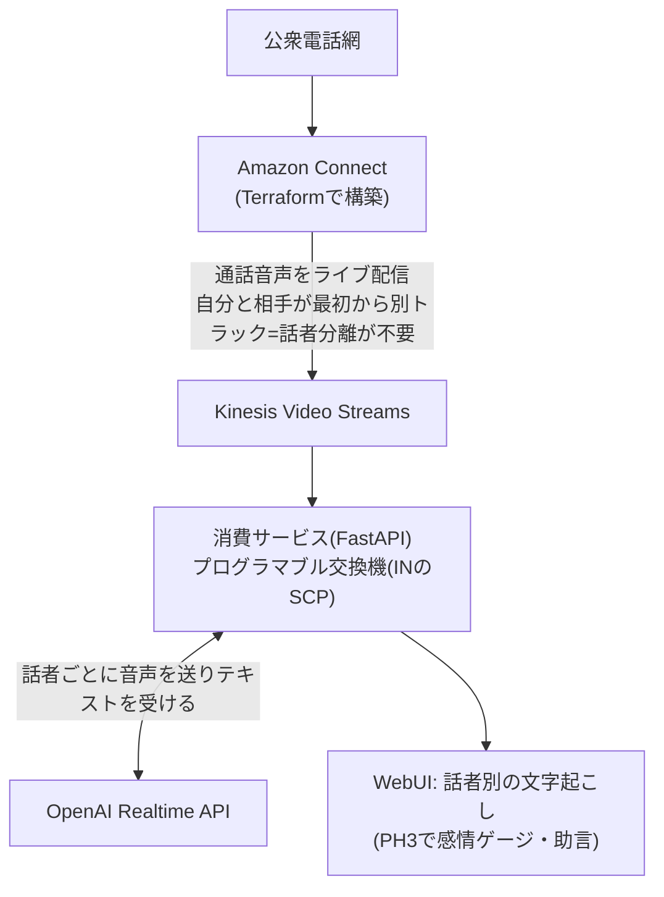

# crossbar_telepath

**電話網の会話から、相手の心理をリアルタイムに嗅ぎ取る。**

crossbar(クロスバー交換機)+ telepath(電話線越しの読心)。
TerraformでフルIaC構築したコールセンター(Amazon Connect)の通話を話者別に分離し、
それぞれの心理状態をOpenAI Realtime APIで分析、WebUIでリアルタイムにモニタリング・助言するシステム。



設計の背景と技術判断は [CLAUDE.md](CLAUDE.md) を参照。

## 現状

- **PH1 完了**: Connect基盤のTerraform(`infra/`)。架電E2E検証済み
- **PH2 進行中**: KVSのリアルタイム受信 → 話者別文字起こし → WebUIへ配信

## 使い方

### 準備

```bash
cp backend/.env.example backend/.env   # OPENAI_API_KEY を設定
```

### ローカル起動

```bash
uv run --directory backend uvicorn main:app --port 8000
```

http://localhost:8000 を開く。コンテナなら `docker compose up --build`。

### 架電せずに試す(リプレイ)

`recordings/` に置いたKVS録音(MKV)を実時間のペースで流し込み、画面まで通しで確認できる。
UIの「録音をリプレイ」ボタン、またはAPIから:

```bash
curl -X POST 'http://localhost:8000/api/replay?file=call.mkv&speed=1.0'
```

### 実通話を拾う

`WATCH_KVS=1` で起動すると、Connectが通話ごとに作るKVSストリームを
ポーリングで見つけて自動的に受信を始める。

```bash
WATCH_KVS=1 uv run --directory backend uvicorn main:app --port 8000
```

## 構成

| パス | 役割 |
|---|---|
| `infra/` | Amazon Connect一式のTerraform(インスタンス・番号・コールフロー・KVS設定) |
| `backend/mkv.py` | MKVの逐次パース。届いたバイトから話者別PCMを取り出す |
| `backend/audio.py` | 電話帯域8kHz → Realtime APIの24kHzへリサンプル |
| `backend/transcribe.py` | 話者1人ぶんのRealtime文字起こしセッション |
| `backend/sources.py` | KVSライブ受信とファイルリプレイ |
| `backend/hub.py` | 通話セッション管理とブラウザ配信 |
| `frontend/` | 話者別チャット表示のWebUI |
| `tools/extract_audio.py` | 録音MKVから話者別WAVを抽出(オフライン検証用) |

## WebSocketのメッセージ

ブラウザへは `/ws` から以下が流れる。PH3の感情・助言もここに種別を足す形で載せる。

| type | 中身 |
|---|---|
| `call_state` | `status`(active/idle)、`label`(ストリーム名) |
| `transcript` | `speaker`(customer/agent)、`item_id`、`delta` または `text`、`final` |
| `speech` | 発話区間の開始・終了 |
| `error` | Realtime API側のエラー |

## 既知の性質・注意点

- KVSのMKVは **CodecIDが `A_AAC` を名乗るが中身は生L16 PCM**(8kHz/16bit/mono)。
  ffmpegはAACとしてデコードしようとして失敗するため、EBMLを自前で歩いている
- トラック番号と話者の対応は決め打ちせず、MKVの `Tracks` 要素から読む
  (実測では 1=AUDIO_TO_CUSTOMER、2=AUDIO_FROM_CUSTOMER)
- 文字起こしの区切りはOpenAIのserver VADに任せている(こちらで無音検出はしない)
- 通話録音は個人データ。`recordings/` はgitignore済みで、**絶対にコミットしない**

前作: [realtime_voice](https://github.com/yoshiharu-ishii/realtime_voice) /
開発記: [pocraft.net](https://pocraft.net)
