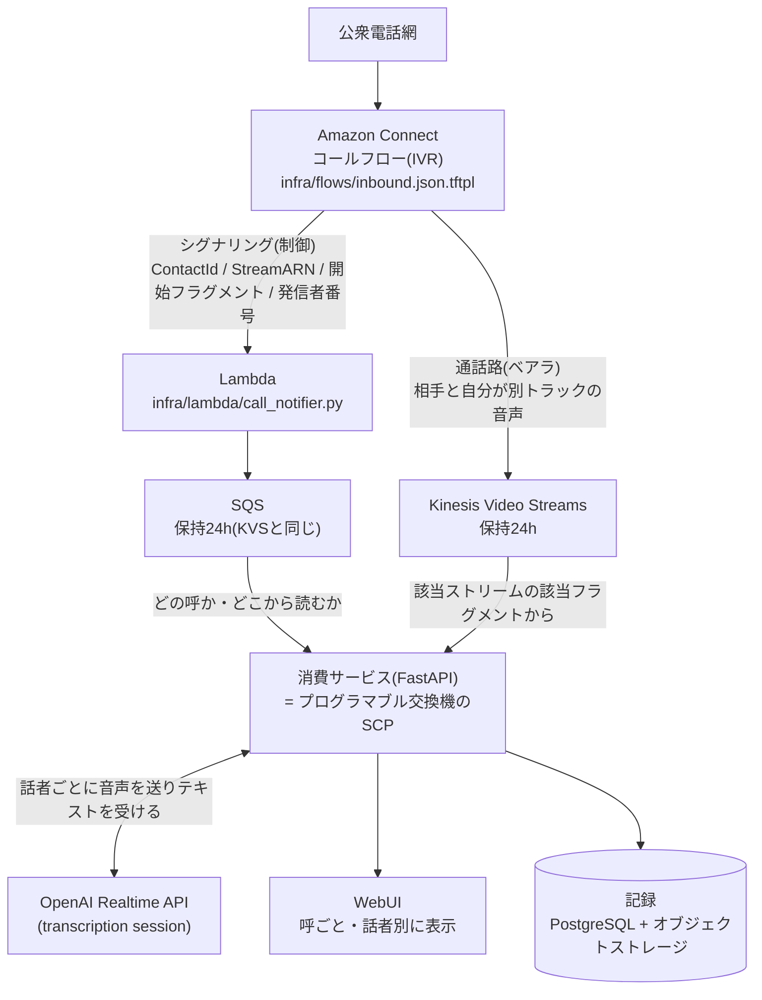
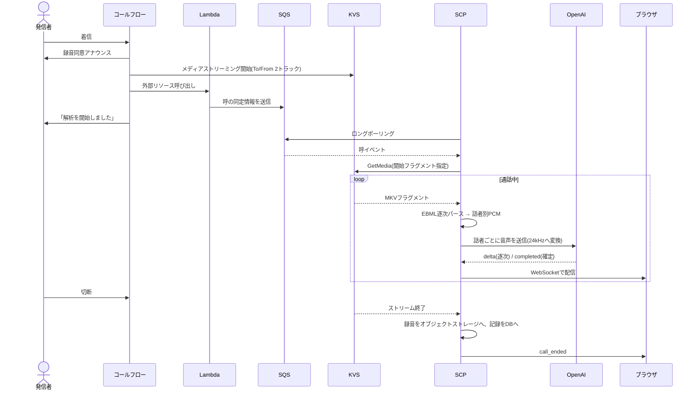
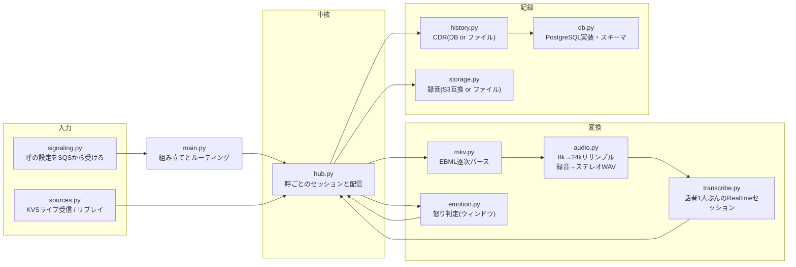
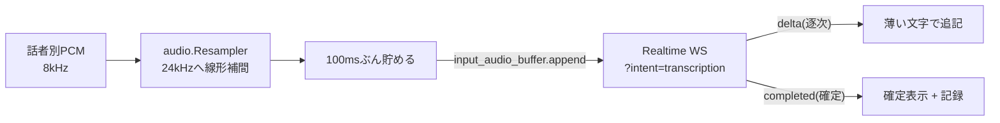
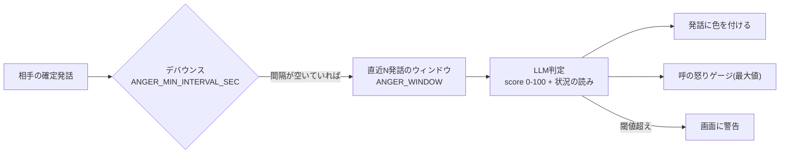
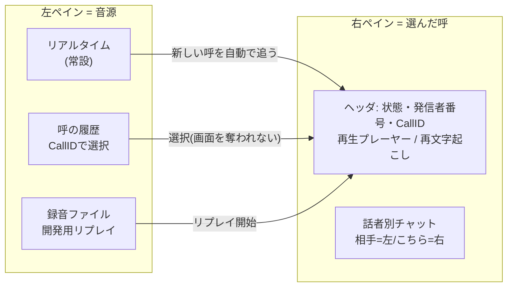
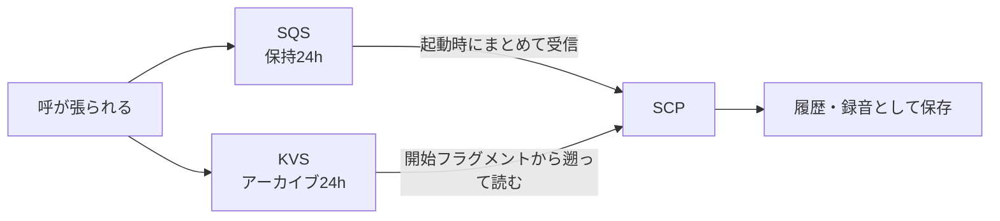

# アーキテクチャ図解

コードを読まなくても仕組みが分かるための図集。実装を変えたら、そのPRでこの図も更新すること。

記録の置き場(DB・オブジェクトストレージ)は [data-model.md](data-model.md)、
起動と運用の手順は [operations.md](operations.md) を参照。

## 1. 全体像: 通話路とシグナリングは別の線

**この構成の要は、制御信号と通話路を分けていること。** KVSのストリーム一覧を眺めて
「新しい呼が来たらしい」と推測するのではなく、コールフローから呼ばれたLambdaが
「いま呼が張られた。ContactIdはこれ、音声はこのストリームのこのフラグメントから」を
SQS経由で知らせる。交換機で共通線信号を受けるのと同じ関係になる。

推測方式をやめたことで、次の4つが同時に手に入った。

- 呼とストリームの対応が**確定**する(取り違えようがない)
- `StartFragmentNumber` から読むので**通話の先頭から**音声が取れる
- 発信者番号など、KVSからは絶対に得られない情報が使える
- 複数の呼を独立したセッションとして**並行処理**できる

## 2. 呼が来てから記録されるまで

**話者分離をしていない点に注目。** Connectは相手の声(FROM_CUSTOMER)と
こちら側の音(TO_CUSTOMER)を最初から別トラックでKVSに流す。誰がいつ喋ったかを
推定する話者ダイアライゼーションは不要で、MKVのトラック番号で振り分けるだけでよい。

## 3. モジュール構成

`config.py` は全モジュールが参照する設定の一覧。値は `.env` に置く
([operations.md](operations.md#設定) 参照)。

| モジュール | 担当 |
|---|---|
| `main.py` | FastAPIの組み立てとルーティングだけ。ロジックは持たない |
| `hub.py` | 呼ごとのセッション管理とブラウザ配信。**差別化の全てが住む場所** |
| `signaling.py` | 呼の設定をSQSから受け取る |
| `sources.py` | 通話音声の供給元(KVSライブ受信、録音リプレイ) |
| `mkv.py` | 届いたバイトからSimpleBlockを取り出す逐次パーサ |
| `audio.py` | リサンプルと、録音のステレオWAV変換 |
| `transcribe.py` | 話者1人ぶんのRealtime文字起こしセッション |
| `emotion.py` | 相手の怒り判定(直近数発話のウィンドウ) |
| `history.py` / `db.py` | 呼の記録(CDR) |
| `storage.py` | 録音の置き場 |

## 4. MKVの罠(KVSから音声を取り出す)

KVSに積まれるMKVには、実測で分かった特有の癖がある。**ここを知らないと必ずハマる。**

- **CodecIDは `A_AAC` を名乗るが、中身は生のL16 PCM**(8kHz/16bit/mono)。
  ffmpegは正直にAACとしてデコードしようとして全フレーム失敗する
- フラグメントごとにEBMLヘッダとSegmentが**再出現**し、Segmentは長さ未知で届く
- SimpleBlockの先頭(トラック番号のvint + 相対タイムコード2バイト + フラグ1バイト)を
  剥がした残りがPCMペイロード
- トラック番号と話者の対応は**決め打ちせず `Tracks` 要素から読む**
  (実測では 1=AUDIO_TO_CUSTOMER、2=AUDIO_FROM_CUSTOMER)

`mkv.py` はこれを踏まえ、降りていくマスター要素(Segment / Cluster / Tracks / TrackEntry)
だけを列挙し、それ以外はサイズ分読み飛ばす。届いた分だけ食わせて、取り出せたブロックを
その場で返す作りになっている。

## 5. 文字起こし(話者ごとに1接続)

話者ごとにOpenAI Realtime APIの**文字起こし専用セッション**を張る。
発話の区切りはserver VADに任せ、こちらでは無音検出をしない。

RESTの `/v1/audio/transcriptions` ではなくRealtimeを使っているのは、**実測で精度が良かった**
から(同じ録音で REST は「申します」、Realtime は「もしもし」と認識した)。VADが発話区間を
切り出してから処理するぶん、電話帯域の薄い音でも当たりやすいと見ている。
低遅延で逐次表示できるのも利点。

24kHzへの変換は精度のためではなく、APIのフォーマット要件を満たすためだけの処理
(8kHzのままでも認識結果に差は出なかった)。

### 短い区間には文脈を渡す

VADで切られた区間は単独だと精度が大きく落ちる。**直近の確定テキストを prompt として
回す**ことで改善する(2026-08-01の実測)。

| prompt | 冒頭の「もしもし」×4 の認識 |
|---|---|
| なし | 持望。/ 本物。/ 僕も。/ もしもし |
| 語彙だけの中立文 | うん。/ お願いします。/ どうぞ。/ もしもし |
| **直近の確定テキスト** | **もしもし ×4** |

**promptにシナリオを書いてはいけない。** 「相手はシステムの動作確認をしている」と
書いたところ、実際には言っていない「動作確認はどうですか?」を出力する幻聴が出た。
渡してよいのは語彙のヒントと、**実際に確定した発話**だけ。

なお通話全体をまとめて処理(REST)すると、逐次処理よりさらに正確になる。
リアルタイム表示は速さ、保存する記録は正確さ、という二層構造にする余地がある。

## 6. ブラウザへ流すイベント

`/ws` から流れる。**すべてのメッセージが `contact_id` を持ち**、どの呼の出来事かが常に確定する。

| type | 中身 |
|---|---|
| `call_started` | `contact_id`、`customer_number`、`instance_arn`、`label`、`started_at` |
| `call_ended` | 同上 + `ended_at` |
| `transcript` | `speaker`(customer/agent)、`item_id`、`delta` または `text`、`final` |
| `speech` | 発話区間の開始・終了 |
| `emotion` | `speaker`、`item_id`、`score`(0-100)、`reason`(状況の読み)、`window`、`alert` |
| `error` | Realtime API側のエラー |

## 7. 怒り判定(PH3)

**判定単位は発話1個ではなく直近数発話のウィンドウ。** 「もしもし」単体に感情は乗らないし、
怒りは流れの中で立ち上がるため。スコアは最新の発話に結び付けて表示するが、意味は
「その発話の時点での会話の状態」であって、その一言の性質ではない。

判定は**別タスクで走らせる**ので、文字起こしの流れを止めない。通話終了時には走っている
判定を待ってから記録するので、結果を取りこぼさない。

出力にはスコアだけでなく **状況の読み**(何に怒っていて何を求めているか)を添える。
オペレータに渡すのはセリフのカンペではなく状況情報にする、という方針
(相手から見て「AIにいなされている」と感じさせないため)。

判定対象は**相手の発話のみ**。オペレータ側の発話は文脈として読むだけで評価しない。

### コスト設計

テキスト判定は極めて安い(1通話1円未満)ので常時走らせる。一方、音声のトーンまで見る
判定はRealtime APIの音声入力課金が通話時間ぶん乗るため、既定では止めてある
(`VOICE_JUDGE_MODE=off`)。テキストが閾値を超えたときだけ起動する設計を想定している。

常時監視は安い信号系でやり、高価な解析装置は必要な呼にだけ落とす、という考え方。

## 8. 画面の構造

左ペインが音源の一覧、右ペインが選んだ呼の中身。**モードが2つある**。

**履歴の呼を見ている間は、新しい呼が来ても画面を奪われない。** 過去の呼を調査中に
着信で画面が飛ぶ事故を防ぐため。「リアルタイム」をクリックしたときだけ追従モードに戻る。

## 9. リプレイと再文字起こし(原本と派生)

録音を**原本**、文字起こしを**派生データ**として扱う。この割り切りが3つの機能を生んでいる。

| 操作 | 入力 | CallID | 記録 |
|---|---|---|---|
| 実通話 | KVS | Connectが採番 | 録音・記録とも保存 |
| リプレイ(開発用) | `recordings/` 直下のMKV | 新規採番 | 保存しない |
| 再文字起こし | **その呼の録音** | **同じCallIDのまま** | 記録だけ上書き |

再文字起こしがあることで、文字起こしモデルを変えたときの聞き比べや、PH3の怒り判定を
過去の呼に遡って適用することが、架電せずにできる。

**注意点として、再処理では通話の時刻を動かさない。** 開始・終了時刻は元の呼の値を引き継ぐ
(過去に終了時刻を現在時刻で上書きしてしまい、40秒の通話が3631秒に化けたバグがあった)。

## 10. 呼を取り逃さない仕組み

SQSのメッセージ保持を、KVSの音声保持と同じ24時間に揃えてある。これにより
**消費サービスが止まっている間に来た呼も、起動時に自動で処理される**。

呼イベントはキューで待ち、音声はアーカイブに残り、`StartFragmentNumber` があるので
通話が終わっていても先頭から丸ごと取れる。**シグナリングのキューが留守番電話を兼ねている。**

保持期限内であれば、記録し損ねた呼も後から復元できる(手順は
[operations.md](operations.md#取り逃した呼の救出) 参照)。
