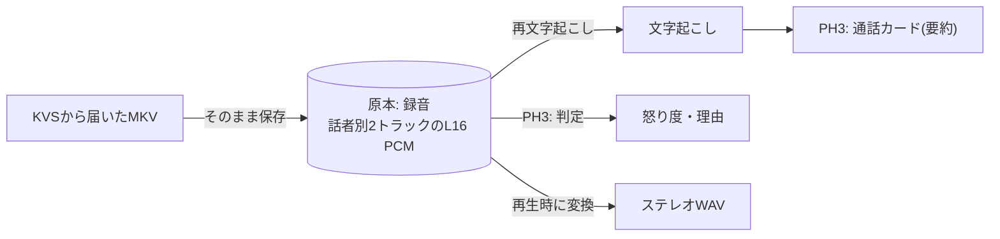
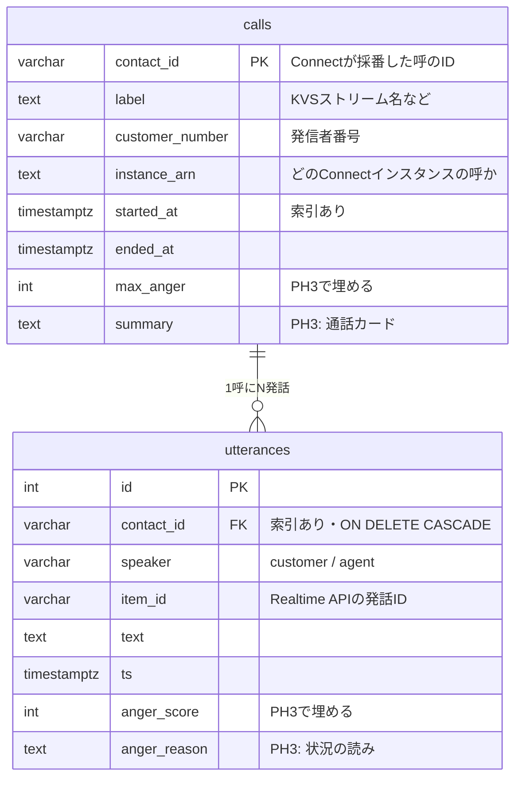
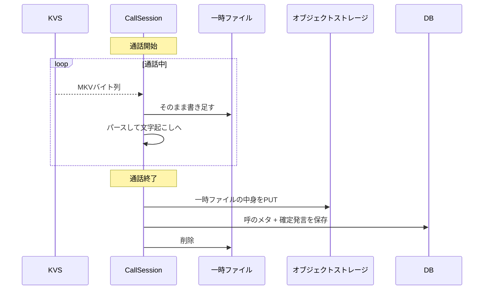

# データモデルと記録の置き場

呼の記録(CDR)と通話音声をどこに、どんな形で持つか。
全体の仕組みは [architecture.md](architecture.md)、動かし方は [operations.md](operations.md)。

## 1. 原本と派生

**この設計の背骨は、録音を原本、それ以外を派生データと割り切っていること。**



派生データはいつでも作り直せるので、原本さえ守れば復旧できる。実際、記録を取り逃した
2本の呼はKVSのアーカイブから音声を救出し、文字起こしは後から生成して復元した。

変換済みWAVを保存していないのも同じ理由。変換はnumpyで数十msなので、二重管理の方が高くつく。

## 2. 置き場は3通り

環境変数で決まる。**ローカルと本番で同じAPI・同じエンジン**を使うので、コードパスが分岐しない。

| 記録 | ローカル(compose) | 本番 | 未設定時 |
|---|---|---|---|
| 呼のメタ・発話 | PostgreSQL 17 | Aurora PostgreSQL | `recordings/calls/*.json` |
| 通話音声(MKV原本) | MinIO | S3 | `recordings/calls/*.mkv` |

`DATABASE_URL` と `S3_BUCKET` を空にすればファイルだけで動くので、**コンテナを立てずに
開発できる**。読み出しはオブジェクトストレージ→ローカルの順に探すため、移行前の録音も
そのまま見え続ける。

## 3. スキーマ



**時刻はDB内では `timestamptz`**。「時間帯別の傾向」のような集計をSQLで書けるようにするため。
外に出すときはUNIX秒に戻すので、画面やAPIから見たデータの形はファイル実装のときと変わらない。

`instance_arn` は、シグナリングで届いているのに捨てていた実データ。どの事業者の交換機から
来た呼かを表すので、将来テナントを分ける日の足がかりになる。
**`tenant_id` / `user_id` はPH5(隔離の仕組みとセット)まで入れない** — 列だけ足しても
「全クエリが必ずテナントで絞られる保証」が無ければ安全性は増えないため。

### オブジェクトストレージのキー

```
s3://<S3_BUCKET>/calls/<contact_id>.mkv
```

ファイル運用時は `recordings/calls/<contact_id>.mkv`。どちらも `storage.py` が吸収する。

## 4. 書き込みのタイミング



**通話中はローカルの一時ファイルに書き、終了時にまとめて保存する。** Fargateでは
ローカルディスクが揮発するため、置き場の判断を `storage.py` に委ねている。
1通話1〜2MB程度なので、マルチパートアップロードは不要。

DB書き込みとS3アップロードは同期処理なので、`asyncio.to_thread` に逃がしてある
(同時通話中にイベントループを止めないため)。

再文字起こしでの上書きは、同じ `contact_id` の行を消してから入れ直す。
発話が二重に積み上がらないようにするため。

## 5. スキーマ変更(Alembic)

**スキーマの正はAlembic。** SQLAlchemyの `create_all` は既存テーブルに列を足せず、
エラーも出さずに黙って無視するため、マイグレーションに一本化してある。

```bash
# backend/ で db.py のテーブル定義を編集したあと
uv run alembic revision --autogenerate -m "説明"
uv run alembic upgrade head    # アプリ起動時にも自動で走る
```

接続先は `alembic.ini` ではなく `.env` の `DATABASE_URL` を見る
(設定の出どころをアプリと一本化し、iniに秘密を残さないため)。

現在のリビジョン:

```
<base> -> d32f4d43158a  baseline: calls and utterances
       -> 63d81632375d  add instance_arn to calls (head)
```

### 注意点

- **autogenerateは列名の変更を「削除+追加」と誤認する。** そのまま流すとデータが消えるので、
  生成されたファイルは必ず読むこと(Alembic自身も `please adjust!` と書く)
- **データの修正もマイグレーションで書く。** 一度、既存データの不正値をその場限りの
  スクリプトで直してしまい、移行元ファイルには壊れた値が残る状態を作った
- **起動時の自動upgradeは単一インスタンス前提。** タスクを複数立てる段階では、
  デプロイ時に一度だけ流す形へ移す必要がある

## 6. 既存データの移行

ファイル運用から移すときは、それぞれのツールを使う。

```bash
uv run python ../tools/migrate_history.py      # JSON → DB
uv run python ../tools/migrate_recordings.py   # ローカルMKV → オブジェクトストレージ
```

どちらも `--delete-local` を付けるまで元ファイルを消さない。

## 7. 個人データの扱い

通話音声と文字起こしは個人データである。

- `recordings/` は **gitignore済み**。録音も記録も絶対にコミットしない
- 本番のS3ではSSE-KMS暗号化を設定する(PH1でKVSに対して行ったのと同じ形)
- 保持期間はライフサイクルで制御する。カスハラ対策の文脈では長期保持が要件になり得るので、
  Terraform変数にしておく
- 録音同意はプロトコルに焼き込む(コールフローの冒頭でアナウンスしてから
  ストリーミングを開始する)
