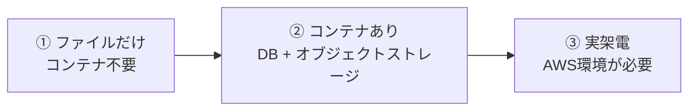

# 動かし方と運用

仕組みは [architecture.md](architecture.md)、記録の持ち方は [data-model.md](data-model.md)。

## 1. 3つの動作モード

用途に応じて、立てるものが変わる。



| モード | 必要なもの | 用途 |
|---|---|---|
| ① ファイルだけ | `.env` の `OPENAI_API_KEY` のみ | ロジックの試作。録音リプレイで画面まで通る |
| ② コンテナあり | + `docker compose up -d db minio` | 本番と同じ永続化で試す |
| ③ 実架電 | + `terraform apply` | シグナリングとKVS受信を含む通し確認 |

①②は**AWS環境なしで動く**。手元の録音がそのままテストデータになるので、
判定ロジックのイテレーションは架電せずに回せる。

## 2. 起動

```bash
cp backend/.env.example backend/.env   # OPENAI_API_KEY を設定
uv run --directory backend uvicorn main:app --port 8000
```

http://localhost:8000 を開く。起動ログに現在の置き場が出る。

```
INFO db: database ready: localhost:5433/crossbar
INFO main: 呼の記録: postgres / 録音: s3
```

コンテナを使う場合は先に立てておく。

```bash
docker compose up -d db minio      # MinIOコンソール: http://localhost:9001
docker compose up --build          # アプリごとコンテナで動かす場合
```

`docker compose down` で停止(データはボリュームに残る)。`down -v` でデータごと削除。

## 3. 設定

**設定はすべて `.env`**。`config.py` は「どんな設定があるか」の一覧と既定値を持つだけで、
値の置き場ではない。項目を足したら `.env.example` にも必ず追記する。

主なもの(全項目は `backend/.env.example`):

| 変数 | 意味 |
|---|---|
| `OPENAI_API_KEY` | **秘密**。本番ではSSM SecureStringから注入する |
| `WATCH_CALLS` | シグナリング(SQS)を監視して実通話を拾うか。0ならリプレイ専用 |
| `DATABASE_URL` | 空なら呼の記録はJSONファイルへ |
| `S3_ENDPOINT_URL` / `S3_BUCKET` | MinIO利用時のみ設定。空なら本物のS3(IAMロール) |
| `ANGER_*` / `VOICE_JUDGE_MODE` | PH3の感情判定。音声判定は課金が重いので既定は `off` |

`RECORDINGS_DIR` だけは既定値のままにしておくこと。ホストの絶対パスを書くと
コンテナ内で壊れる(既定値がホスト・コンテナ双方で正しい場所を指す)。

**設定にしていないもの**: `SOURCE_RATE=8000` / `SAMPLE_WIDTH=2` / `SPEAKER_BY_TRACK_NAME` は
Amazon Connectの仕様で決まる値であって設定ではない。外に出すと「変えられるが変えたら壊れる」
項目が増えるだけなので、定数のまま根拠をコメントに残してある。

## 4. 架電せずに試す

左ペインの「録音ファイル」をクリックするか、APIから。

```bash
curl -X POST 'http://localhost:8000/api/replay?file=call.mkv&speed=1.0'
```

過去の呼を録音から再処理する場合(同じCallIDのまま記録を上書きする):

```bash
curl -X POST 'http://localhost:8000/api/reprocess/<contact_id>?speed=2.0'
```

リプレイは同時1本まで(連打でセッションが積み上がらないようにするため)。実通話は無制限。

## 5. AWS環境を建てる / 壊す

```bash
cd infra
terraform apply     # 7リソース。電話番号は在庫の取り合いで初回が落ちることがある(再実行で別番号)
terraform output phone_number
```

**番号は日額課金**なので、検証しない期間は落とすこと。

```bash
terraform destroy
# Connectが動的に作るKVSストリームはTerraform管理外なので個別に削除する
aws kinesisvideo list-streams --output json | \
  python3 -c "import json,sys;[print(s['StreamARN']) for s in json.load(sys.stdin)['StreamInfoList']]"
aws kinesisvideo delete-stream --stream-arn <ARN>
```

再applyすると**電話番号は変わる**(解放済みのため)。

## 6. 実架電での確認

```bash
WATCH_CALLS=1 uv run --directory backend uvicorn main:app --port 8000
```

取得した番号へ架電し、アナウンスの後に話す。画面で確認するのは4点。

1. 呼カードが自動で現れ、**発信者番号**が表示される(シグナリングが効いている証拠)
2. 「解析を開始しました」が**こちら側(緑)**のバブルに出る
3. 発話が**相手側(赤)**のバブルに逐次流れる
4. 約30秒ごとに相槌が緑側に出る(1人架電でも両話者を検証できるようにフローへ入れてある)

うまくいかないときの切り分けは、CloudWatch Logs の Lambda ログ(呼イベントが出ているか)→
SQSにメッセージが残っていないか → アプリのログ(`GetMedia connected` が出ているか)の順。
`GET /api/streams` でKVS側のストリーム一覧も見られる。

## 7. 取り逃した呼の救出

**保持期限(24時間)内なら、記録し損ねた呼も復元できる。**

音声はKVSのアーカイブに、ContactIdはConnectの通話検索に残っている。

```bash
# 1. ContactIdと時刻を得る
aws connect search-contacts --instance-id <ID> \
  --time-range "Type=INITIATION_TIMESTAMP,StartTime=<epoch>,EndTime=<epoch>"

# 2. フラグメントを列挙し、20秒以上の空白を呼の境界として分割
#    3. get-media-for-fragment-list で区間ごとにMKVを取得し recordings/calls/ へ
```

音声さえ戻せば、文字起こしはUIの「再文字起こし」で生成できる(原本と派生の原則)。

なお通常運転では、SQSの保持をKVSと同じ24時間に揃えてあるため、**消費サービスが止まって
いる間に来た呼は起動時に自動で処理される**。手動救出が要るのは「イベントは消費したが
保存に失敗した」場合だけ。

## 8. コスト

| 項目 | 目安 |
|---|---|
| Connect電話番号(US DID) | 日額課金。**使わない日は destroy** |
| Connect通話・KVS | 検証レベルなら誤差 |
| 携帯から米国番号への国際発信 | 30〜40円/分(コストの支配項) |
| 文字起こし(Realtime) | 1通話5分で数円 |
| 感情判定(テキスト) | 1通話1円未満 |
| 感情判定(音声) | **通話時間ぶん課金**。既定で `off`、閾値超過時だけ起動する設計 |

実験コストの支配項は国際発信料なので、長時間の試行はリプレイで代替する。
1本録っておけば恒久的なテストデータになる。

## 9. 開発時の注意

- **ユーザーのサーバーはポート8000、Claudeの検証は8001**(終わったら止める)
- 静的ファイルは `Cache-Control: no-cache` を返している。更新後のHTMLと古い `app.js` の
  組み合わせでスクリプトが例外死し「画面が反応しない」事故を防ぐため
  (前作 realtime_voice で踏んだ罠の再発防止)
- `WATCH_CALLS=1` のサーバーを同時に2つ立てないこと。SQSのメッセージは
  片方しか受け取れず、呼イベントの取り合いになる
