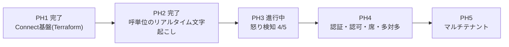

# 現在地とロードマップ

**いま作っているのは「1人が1呼に張り付く」形(1対1)である。** 多対多——複数の席が
それぞれ自分の呼を見る形——は設計を検討したうえで**PH4に送った**。この文書は、
その判断の根拠と、送った先で何を作るのかを残すためのもの。

## 1. 現在地



**PH3は2026-08-03に完了**した:

| | 状態 |
|---|---|
| 発話ごとの色分け・怒りゲージ | 完了 |
| 閾値アラート+状況の読み | 完了 |
| 履歴バッジ(通話中/終了・最大怒り度) | 完了 |
| バックテスト(怒り通話だけ検知) | 合格。実呼75 / 合成85 / 負例0〜10 |
| 音声判定(トーン) | 実装完了(`VOICE_JUDGE_MODE=auto`、gpt-audio) |
| 通話カード(要約・次アクション・カスハラ判定・JSON) | 完了。正例/負例とも検証済み |

**音声判定の実証(2026-08-03完了、これでPH3完全終了)**: 窓を実時間12秒から
**発話区間(`audio_start_ms/end_ms`)の積み上げ**に切り直した(直近の相手発話を
新しい方から約8秒ぶん。区間が無いSTT構成では生窓にフォールバック)。結果:

- **声がテキストを先行する**。合成の怒り通話で「いつまで待たせるんですか」の時点で
  テキスト45に対し声72。テキストが75に達する**2発話前**に声は警戒圏に入っていた。
  早く気づくことが目的の製品にとって、これが音声判定の価値の実証になる
- 実呼(人間の声)でも滑らかに追跡: 35→45→65→72→78→**82**(テキスト最大75を上回る)
- 負例では誤検知なし
- ただし同一台詞のcalm/loud対照実験は55 vs 60で決定打にならず。**TTSは音量を
  正規化するため「怒鳴る」を音響的に作れない**(RMS差1dB)。この実験系の限界であり、
  cold/loud系の素材は人間の録音が要る

## 2. なぜ1対1を先に固めるのか

多対多に必要なものを洗い出したところ、**認可の境界が丸ごと欠けている**ことが分かった。
これは機能追加ではなく作り直しに近く、1対1が固まる前に着手すると両方が中途半端になる。

一方で、残っている2機能(音声判定・通話カード)は**多対多の設計が決まらなくても作れる**。
どちらに倒しても必要になるため、判断を待たずに進む価値がある。

## 3. PH4に送ったもの

### 3.1 認証・認可(最優先)

**現状は認可が存在しない。** これは既知の制約であって、実運用に出す前に必ず塞ぐ。

- `/api/history/{contact_id}` に認証も認可もない。**contact_idを知っていれば誰でも全文が取れる**
- `Hub.broadcast` は全クライアントへ全呼のメッセージを送る。ブラウザ側の
  `if (msg.contact_id !== selectedId) break;` で捨てているだけで、**これは境界ではない**

1席で使う限り無害だが、席が2つになった瞬間に他人の応対内容が見える。通信の秘密の
観点でも、商材としても持たない(「オペレータAはBの通話を見られますか」は必ず聞かれる)。

**着手の順番は「塞いでから鍵をかける」。** 認証を先に入れると「認証したから安全」と
錯覚するが、broadcastが全員に投げている限り認証しても全部見える。

1. `Hub._clients` を `set[WebSocket]` から `dict[WebSocket, Identity]` にし、broadcastを宛先つきにする
2. `/api/history` 系に所有者の判定を通す
3. Cognitoを載せる(realtime_voiceから流用)

### 3.2 席と割り当て

「席」は3つの別々の部品でできている。**認可の実装は割り当ての供給元に依存しない**
(`owner_id` に何が入るかの違いでしかない)ので、境界を先に作れば割り当ては後から差せる。

| 部品 | 問い | 供給元 |
|---|---|---|
| 識別 | このブラウザは誰か | Cognito |
| 割り当て | この呼は誰のものか | Connect または自前 |
| 認可 | 送るか送らないか | 自前。ここが本体 |

割り当ての供給元は3択:

| 方式 | 内容 | 評価 |
|---|---|---|
| A. Connectエージェント | Connectのキュー・ルーティングプロファイルで配る。CCPで受話 | 割り当ても認証も既製品。ただし**電話機をCCPに置き換える**必要があり、既存の電話がある事業者には重い |
| B. 外線転送 | Connectが受けて既存の電話へ転送。音声はKVSに流れ続ける | 電話機はそのまま。ただし代表番号に転送すると**誰が取ったか分からず**、席が成立しない |
| C. 挙手 | 画面で「この呼は私が見る」と宣言 | 厳密ではないが**今すぐ作れて境界を端から端までテストできる**。最終形と同じ境界実装になる |

**Cで境界を作り、後でAに差し替える**のが現時点の方針。

なお現在のコールフローは `TransferToQueue` が0件で、キューにも人にも繋いでいない。
画面の「こちら (TO_CUSTOMER)」の正体はフローのTTSであり、**割り当てという事実がまだ
発生していない**。これが席を語るうえでの本当の欠落である。

### 3.3 役割の分け方

```
応対者   自分に割り当てられた呼だけ。全文
SV       全呼。ただし既定はゲージのみ、本文を開くのは明示操作
```

SVが全呼を見られるのは業務上正当だが、**「開いた」記録を残す**。閲覧できること自体
より、無記録で閲覧できることが問題であるため。`call_views` を1テーブル足すだけで済み、
かつカスハラ証拠の長期保持と同じ売り文句の側に乗る。

**通話カードは応対者の画面に出さない**(2026-08-03決定)。誰に何を見せるかは、
情報の性質で決まる:

| | 性質 | 誰のものか |
|---|---|---|
| 状況パネル・アラート | **今**をどう捌くかの状況情報 | 応対者 |
| 通話カード | **後**の記録・評価・引き継ぎ | SV・後処理 |

応対者にカードを見せてはいけない理由は3つ。(1) 怒鳴られた本人に罵倒の原文引用を
読み返させることになる。(2)「カスハラの疑い」はLLMの推定であって事実認定ではなく、
本人に見せると会社の認定と読まれる——特にfalseのとき、本人の被害感情と画面が衝突する。
(3)「次アクション: 責任者に引き継ぐ」は本人には査定に見える。

状況パネルの「読み」をセリフのカンペにしなかった原則(AIにいなされてる感の回避)が、
時間軸でも効く: **応対中の人には「今」だけ。評価と記録は本人の画面に出さない。**

**アラート通知(音・プッシュ)はSVだけに出す**(2026-08-04決定)。応対者は通知され
る必要がない——相手の怒りを一番よく知っているのは、いま怒鳴られている本人である。
アラートの価値は「知らない人に知らせる」ことにあり、通話の外にいて介入・応援できる
人(SV)のためのもの。応対中の本人に音を鳴らすのは、知っていることを知らせて
集中だけ奪う純粋なマイナス。

| | 応対者(通話の中) | SV(通話の外) |
|---|---|---|
| 状況パネル | 見てもよい(静かに) | 見る |
| アラート通知(音・プッシュ) | **出さない** | **出す** |
| 通話カード | 出さない | 出す |

**応対者の画面は徹底的に静かに、割り込みは全部SVへ。** したがって通知はSVロールの
属性であり、ロールより先に通知を作るのは順序が逆。PH4の認証・認可でロールが
できたとき、SVビューの一部として実装する(「アラートは画面で待つのではなく人を
呼びに行く」という成立条件は、SV側の要件として引き継ぐ)。

現在のUIは実質SV席(監視卓)なのでカード表示は正当。PH4で応対者ビューを作るとき、
カードを含めないこと。

### 3.4 多対多のUI(実測済み)

呼数を振ってブラウザで測った結果、**性能は問題にならず、情報設計が先に壊れる**。

| 同時呼 | `renderList` 1回 | 確定発話1件あたり | DOMノード |
|---|---|---|---|
| 1 | 1.1ms | 0.17ms | 6 |
| 20 | 2.5ms | 1.68ms | 120 |
| 50 | 3.8ms | 4.21ms | 300 |
| 100 | 7.0ms | 7.7ms | 600 |

50呼が3秒に1発話なら毎秒17回 × 4.2ms = 71ms/秒(CPU約7%)。100呼でも25%程度で持つ。
WSも、選択外の呼のdeltaは0.0011msで捨てられるため、**ブロードキャスト方式のままで
クライアント側の負荷は問題にならない**。

壊れるのは人間側。30呼を並べると:

```
同時呼 30 / 画面に見える件数 11 / 閾値超えの呼 6
```

閾値超えの呼が画面外に隠れる。しかも並び順が `started_at` なので、荒れている呼が
上に来ない。**CPUではなく目が先に飽和する。**

したがってPH4のUIは、優先度の高い順に:

1. **並びを怒り順に切り替え可能にする** — 一番安く、一番効く
2. **`Hub.broadcast` の直列awaitを `gather` に** — 1台が詰まると全員が待つ。視聴者が複数になる前提条件
3. 一覧をゲージの壁にする(本文は畳む)
4. `renderList` の差分更新 — **急がない**。実測で判明

### 3.5 STTバックエンド切替

`TRANSCRIBE_BACKEND=openai|aws` の切り替え。精度の話として始まったが、
**スケールの話でもある**ことが分かった。呼あたりRealtimeセッションを2本(話者ごと)
張るため、同時呼が増えると先に頭を打つのはUIではなくSTTの同時接続数とコストになる。

## 4. PH5に送ったもの

マルチテナント。retrofitのコストが最も高いのはここだが、高いのは列の追加ではない。

- 列を足す → 安い(Alembicがある)
- 全クエリに境界を通す → 高い
- 認証と接続する → 高い

**列だけ先に足すのは危険。** 境界を通していないのに「テナント対応済み」と錯覚する分
だけ悪化する。代わりに、**呼の一覧を引くクエリを `history.list_records()` の1箇所に
集約したままにしておく**こと。PH4で複数呼の画面を作るときに直クエリを生やさなければ、
それだけで準備は終わる。

## 5. スケジュール(2026-08-03再調整: フェーズのテーマを絞って集中する)

音声判定の実証はPH4に持ち越さず**PH3内で終わらせる**。
**PH4は「SPA化+認証・認可」に閉じる**(ユーザー決定)。土台の書き直しと境界の
導入だけをやり、多対多UIとSTT切替はPH5へ送る。

| | テーマ | 内容 |
|---|---|---|
| PH3(残) | 音声判定の実証 | 窓を発話区間で切り直し+対照実験。これでPH3完全終了 |
| **PH4** | **SPA化+認証・認可** | ① React+TS+ViteへUIを機能等価で書き直す(5.1) ② Cognito ③ broadcastの宛先化+API認可+席(3.1〜3.3の順番で。塞いでから鍵をかける)。ログイン画面と役割別ビューの土台はSPAの上に作る |
| PH5候補 | 多対多のUI | 3.4の優先度で。ゲージの壁・怒り順・応対者/SVビュー |
| PH5候補 | STTバックエンド切替 | 3.5 |

### 5.1 SPA化の判断(PH4.1)

**なぜ今か**: PH4はUIの重いフェーズ(役割別ビュー・ゲージの壁・ログイン)であり、
手動で状態とDOMを同期させる現行構成では、既に2回踏んだクラスのバグ(通話終了で
状況パネルが消える等)を積み増すことになる。書き直すコストは今が最安——フロント合計
736行で、**jsdomテスト4本が仕様書として機能する**(書き直し後の振る舞い一致を機械で
確認できる)。ビルドがファイル名にハッシュを付けるため、**ブラウザキャッシュの罠
(古いapp.js+新しいHTMLでスクリプトが黙って死ぬ。過去2プロジェクトで発生)も構造的に消える**。

**React + TS + Vite にした理由**: 最も標準的でAI支援が厚い。ローグライク移植で
TypeScript経験を積んだ直後であり言語の学びが接続する(2026-08-03ユーザー決定)。

**失うもの**: ビルド無しの単純さ(ファイルを置くだけで動く)。PH4のUI要件と天秤に
かけて手放すと判断した。

**やること**: Viteスキャフォールド → 機能等価の移植 → FastAPIは `dist/` を配信 →
テストをVitest+Testing Libraryへ移植(既存4本の振る舞いを保つ) → CIのfrontendジョブに
ビルドを追加。**renderListの全再構築(3.4の積み残し4番)はkeyedレンダリングで自然に解消**。

### 5.2 対照実験の素材の注意

TTSは「大声で怒鳴る」は演じられるが**「静かに抑えた怒り」は描き分けられない**
(calmとRMS差1dB)。cold系の検証素材が要る場合は人間の録音が必要。
