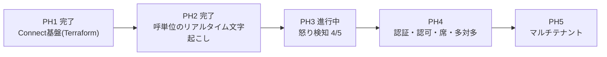

# 現在地とロードマップ

**いま作っているのは「1人が1呼に張り付く」形(1対1)である。** 多対多——複数の席が
それぞれ自分の呼を見る形——は設計を検討したうえで**PH4に送った**。この文書は、
その判断の根拠と、送った先で何を作るのかを残すためのもの。

## 1. 現在地



PH3の到達状況:

| | 状態 |
|---|---|
| 発話ごとの色分け・怒りゲージ | 完了 |
| 閾値アラート+状況の読み | 完了 |
| 履歴バッジ(通話中/終了・最大怒り度) | 完了 |
| バックテスト(怒り通話だけ検知) | 合格。実呼75 / 合成85 / 負例0〜10 |
| 音声判定(トーン) | **未着手**。`VOICE_JUDGE_MODE=off` の枠のみ |
| 通話カード(要約・次アクション・JSON) | **未着手** |

## 2. なぜ1対1を先に固めるのか

多対多に必要なものを洗い出したところ、**認可の境界が丸ごと欠けている**ことが分かった。
これは機能追加ではなく作り直しに近く、1対1が固まる前に着手すると両方が中途半端になる。

一方で、残っている2機能(音声判定・通話カード)は**多対多の設計が決まらなくても作れる**。
どちらに倒しても必要になるため、判断を待たずに進む価値がある。

## 3. PH4に送ったもの

### 3.1 認証・認可(最優先)

**現状は認可が存在しない。** これは既知の制約であって、実運用に出す前に必ず塞ぐ。

- `/api/history/{contact_id}` に認証も認可もない。**contact_idを知っていれば誰でも全文が取れる**
- `Hub.broadcast` は全クライアントへ全呼のメッセージを送る。ブラウザ側の
  `if (msg.contact_id !== selectedId) break;` で捨てているだけで、**これは境界ではない**

1席で使う限り無害だが、席が2つになった瞬間に他人の応対内容が見える。通信の秘密の
観点でも、商材としても持たない(「オペレータAはBの通話を見られますか」は必ず聞かれる)。

**着手の順番は「塞いでから鍵をかける」。** 認証を先に入れると「認証したから安全」と
錯覚するが、broadcastが全員に投げている限り認証しても全部見える。

1. `Hub._clients` を `set[WebSocket]` から `dict[WebSocket, Identity]` にし、broadcastを宛先つきにする
2. `/api/history` 系に所有者の判定を通す
3. Cognitoを載せる(realtime_voiceから流用)

### 3.2 席と割り当て

「席」は3つの別々の部品でできている。**認可の実装は割り当ての供給元に依存しない**
(`owner_id` に何が入るかの違いでしかない)ので、境界を先に作れば割り当ては後から差せる。

| 部品 | 問い | 供給元 |
|---|---|---|
| 識別 | このブラウザは誰か | Cognito |
| 割り当て | この呼は誰のものか | Connect または自前 |
| 認可 | 送るか送らないか | 自前。ここが本体 |

割り当ての供給元は3択:

| 方式 | 内容 | 評価 |
|---|---|---|
| A. Connectエージェント | Connectのキュー・ルーティングプロファイルで配る。CCPで受話 | 割り当ても認証も既製品。ただし**電話機をCCPに置き換える**必要があり、既存の電話がある事業者には重い |
| B. 外線転送 | Connectが受けて既存の電話へ転送。音声はKVSに流れ続ける | 電話機はそのまま。ただし代表番号に転送すると**誰が取ったか分からず**、席が成立しない |
| C. 挙手 | 画面で「この呼は私が見る」と宣言 | 厳密ではないが**今すぐ作れて境界を端から端までテストできる**。最終形と同じ境界実装になる |

**Cで境界を作り、後でAに差し替える**のが現時点の方針。

なお現在のコールフローは `TransferToQueue` が0件で、キューにも人にも繋いでいない。
画面の「こちら (TO_CUSTOMER)」の正体はフローのTTSであり、**割り当てという事実がまだ
発生していない**。これが席を語るうえでの本当の欠落である。

### 3.3 役割の分け方

```
応対者   自分に割り当てられた呼だけ。全文
SV       全呼。ただし既定はゲージのみ、本文を開くのは明示操作
```

SVが全呼を見られるのは業務上正当だが、**「開いた」記録を残す**。閲覧できること自体
より、無記録で閲覧できることが問題であるため。`call_views` を1テーブル足すだけで済み、
かつカスハラ証拠の長期保持と同じ売り文句の側に乗る。

### 3.4 多対多のUI(実測済み)

呼数を振ってブラウザで測った結果、**性能は問題にならず、情報設計が先に壊れる**。

| 同時呼 | `renderList` 1回 | 確定発話1件あたり | DOMノード |
|---|---|---|---|
| 1 | 1.1ms | 0.17ms | 6 |
| 20 | 2.5ms | 1.68ms | 120 |
| 50 | 3.8ms | 4.21ms | 300 |
| 100 | 7.0ms | 7.7ms | 600 |

50呼が3秒に1発話なら毎秒17回 × 4.2ms = 71ms/秒(CPU約7%)。100呼でも25%程度で持つ。
WSも、選択外の呼のdeltaは0.0011msで捨てられるため、**ブロードキャスト方式のままで
クライアント側の負荷は問題にならない**。

壊れるのは人間側。30呼を並べると:

```
同時呼 30 / 画面に見える件数 11 / 閾値超えの呼 6
```

閾値超えの呼が画面外に隠れる。しかも並び順が `started_at` なので、荒れている呼が
上に来ない。**CPUではなく目が先に飽和する。**

したがってPH4のUIは、優先度の高い順に:

1. **並びを怒り順に切り替え可能にする** — 一番安く、一番効く
2. **`Hub.broadcast` の直列awaitを `gather` に** — 1台が詰まると全員が待つ。視聴者が複数になる前提条件
3. 一覧をゲージの壁にする(本文は畳む)
4. `renderList` の差分更新 — **急がない**。実測で判明

### 3.5 STTバックエンド切替

`TRANSCRIBE_BACKEND=openai|aws` の切り替え。精度の話として始まったが、
**スケールの話でもある**ことが分かった。呼あたりRealtimeセッションを2本(話者ごと)
張るため、同時呼が増えると先に頭を打つのはUIではなくSTTの同時接続数とコストになる。

## 4. PH5に送ったもの

マルチテナント。retrofitのコストが最も高いのはここだが、高いのは列の追加ではない。

- 列を足す → 安い(Alembicがある)
- 全クエリに境界を通す → 高い
- 認証と接続する → 高い

**列だけ先に足すのは危険。** 境界を通していないのに「テナント対応済み」と錯覚する分
だけ悪化する。代わりに、**呼の一覧を引くクエリを `history.list_records()` の1箇所に
集約したままにしておく**こと。PH4で複数呼の画面を作るときに直クエリを生やさなければ、
それだけで準備は終わる。

## 5. 当面の作業

1. 音声判定(トーン) — PH3の核心。テキストが弱い領域を補う
2. 通話カード — 切断後にLLM1回でJSON生成。外部連携のスキーマ叩き台を兼ねる

音声判定の検証は**同じ台詞を「穏やかな口調」と「凍った怒りの口調」で2本合成**する。
台詞が同一なのでテキスト判定は同スコアになるはずで、音声判定だけが差を付ければ機能の
価値が証明される。差が出なければ投資に見合わないと分かる。どちらに転んでも結論が出る
(合成通話の作り方は [operations.md](operations.md) の「台本から通話を合成する」)。
