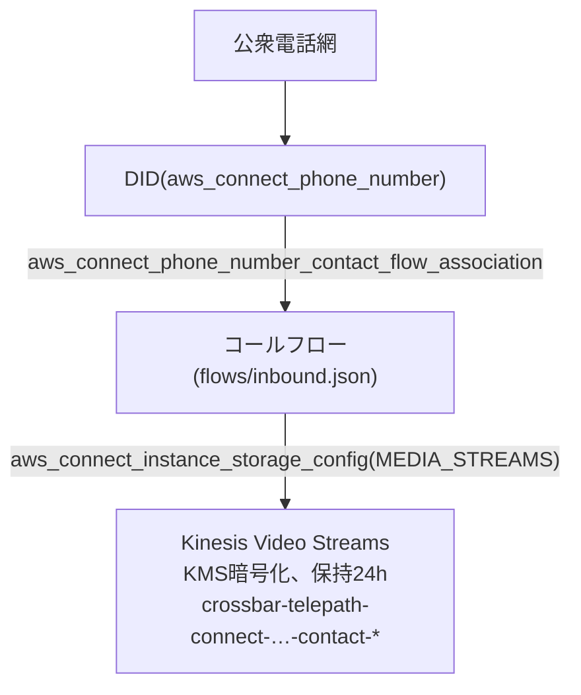
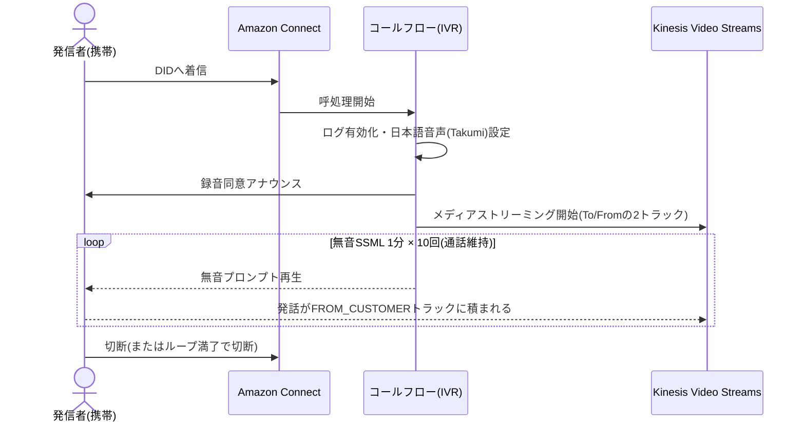

# infra — Amazon Connect 基盤(PH1)

TerraformでコールセンターをフルIaC構築する。PH1のスコープは
**「架電すると録音同意アナウンスが流れ、通話音声がKVSにライブ配信される」**まで。

## 構成



架電時の呼処理:



- 自分(To)と相手(From)の音声は**同一KVSストリーム内の別トラック**で届く(トラック1=TO、トラック2=FROM)
- コールフローは新フロー言語(`Version: 2019-10-30`)。旧形式(modules)ではないので注意

## 使い方

```bash
cd infra
terraform init
terraform plan
terraform apply
# outputs の phone_number に携帯から架電して検証
```

state はローカル管理(gitignore済み)。**tfstateは絶対にコミットしない**。

## 検証手順

1. `terraform output phone_number` の番号に架電
2. 録音同意アナウンス(日本語)が流れることを確認
3. 何か話してから切断
4. KVSにストリームができていることを確認:
   ```bash
   aws kinesisvideo list-streams --output table
   ```

## コストメモ

- Connectインスタンス自体: 無料(従量課金のみ)
- US DID: 日額課金(月額数百円級)+着信従量。**検証しない期間が長いなら destroy 推奨**
- KMSキー: 約$1/月
- KVS: 取り込み・保持とも従量。検証通話レベルなら誤差
- 日本の+81番号は書類審査が必要。必要になったら `phone_number_country_code = "JP"`
  に変えるのではなく、まずAWSサポートで番号申請の要件を確認すること

## 既知の注意点

- `aws_connect_phone_number` は在庫の取り合いで
  「Phone number not available」で失敗することがある。再applyでリトライすれば別番号で取れる
- インスタンスエイリアス(`connect_instance_alias`)はグローバル一意
- メディアストリーミングのstorage config(`MEDIA_STREAMS`)はコールフローの
  ストリーミング開始ブロックより**先に**存在している必要がある(このmoduleでは依存関係で保証済み)
